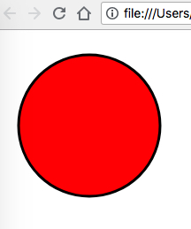

Html External Svg Demo
====================

在html如何load一个外部的svg图片。

注意：
1. svg图片实际上是一个xml文件，可以以文本形式打开
2. 不能使用文件的形式打开html（e.g. `open index.html`），不能显示，必须使用http的形式
3. 使用`<use xlink:href="sample.svg#Layer_1"/>`时，要指定具体渲染哪个层（`#Layou_1`，在svg文件中可以找到)，不然空白
4. 有的svg文件中的`svg`指定了`width`和`height`，会导致渲染时难以正确resize。正确做法是将其删除，同时保留`viewBox`
   参见： https://stackoverflow.com/a/3120785/342235
5. 在safari下，如果`<use`中使用的是`href`而不是`xlink:href`，则无法正常显示（在其它浏览器中正常）。为了统一，最好都使用`xlink:href`

```
open index.html
```

